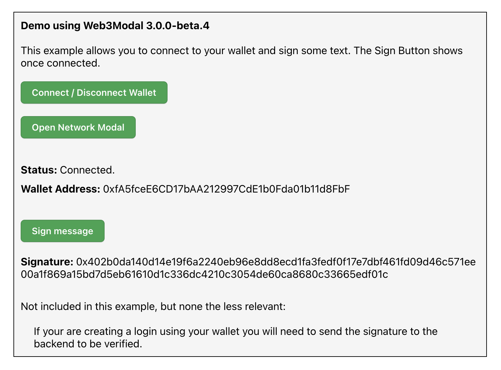

# Getting Started

## Overview

## Install and run example

(i) mkdir ~/workspace

(ii) cd workspace

(iii) git clone https://github.com/spotadev/symbiont-wallet-sign-web.git

(iv) cd symbiont-wallet-sign-web

(v) Copy .env.sample to .env

(vi) Go to https://cloud.walletconnect.com/sign-in and get your projectId.  Put it in .env.

(vii) npm install

(viii) npm run start

(ix) Open app in web browser:  http://localhost:3000/

(x) You will see:

  

